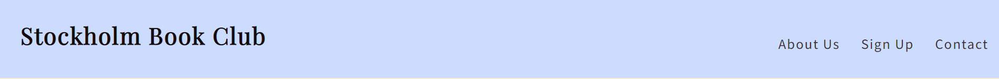
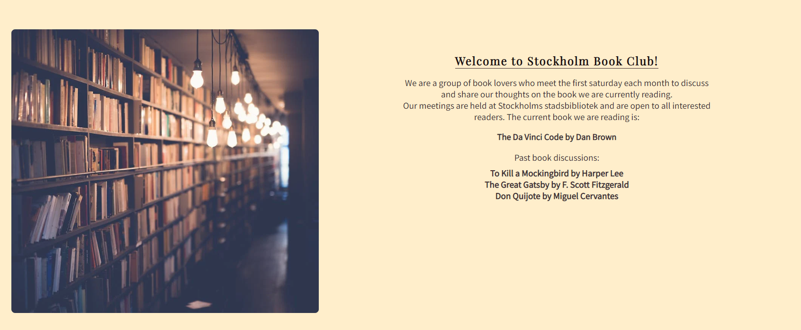
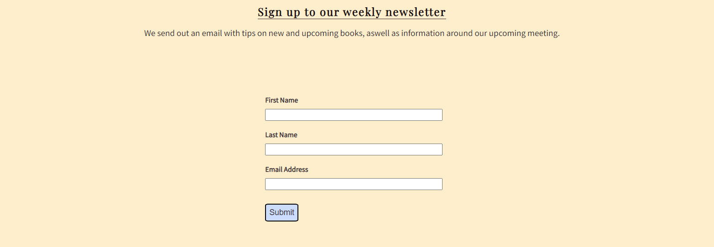
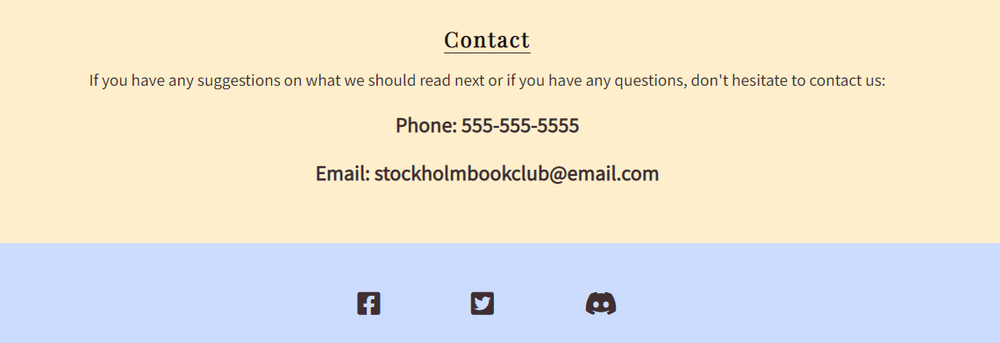
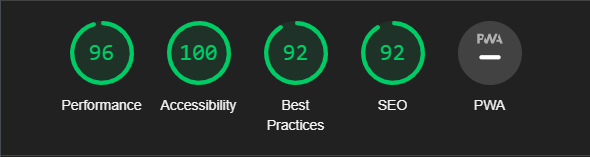

# Stockholm Book Club

Stockholm Book Club is a website for people who loves to read books and wants a community who shares that same love. 
Stockholm Book Club is offers a community for people of all ages that like to read and discuss books.
Users of this website will find all the information needed to join the book club. For example: how to get in contact, what book we are currently reading and a sign up form for a weekly book tip email. 

## Features

---

### Navigation and Logo

- In the top left corner we have the logo. If clicked it will take you to the homepage.
- Featured at the top of the website is a navigation bar that will take you to the different sections of the website: Logo, About Us, Sign Up and Contact.
- This allows the users easy access to what the they are looking for without having to scroll down.

### About Us

- This section has a short text describing what the book club does, when the club has its meetings and what book we are currently reading.
- The About Us text also tells the user what books the book club have read in the past and where the meetings are held.

### Sign Up

- The Sign Up part has a form for users to enter their name and email address for weekly emails.
- These weekly emails contains tips on new books and information about our upcoming meetings.
- This form grants the user access to the weekly emails to get recommended books and updates about the club's meetings.

### Contact

- In the Contact section there is a text which prompts the user to send an email or call the number if they have suggestions for books that the club should read or if they have any questions.
- Under the contact section we have the clubs social media links. If the user click them they will be taken to Stockholm Book Club's facebook, twitter or discord page.
- The Contact section shows the user how to reach out if they have any questions or if they want to check out the social media pages.

## Testing

---

- I confirmed that this project is responsive on different screen sizes with DevTools in Google Chrome.
- The website is tested on Firefox and Chrome.
- I confirm that the form requires correct text in each field before it can be submitted. 
- I have confirmed that the internal and external links works as expected.

## Bugs

---

## Solved Bugs

## Unfixed Bugs

- I am having trouble with the responsiveness of my image on smaller screen sizes. Hopefully in the future i can solve this bug.
- A bug i did not have time to squash is the light blue background as well as the navigation bar looks weird on really small phone screens.

## Validator Testing

---

HTML validator (w3c markup service) showed no errors.

CSS validator (Jigsaw) showed no errors.

I confirmed using Lighthouse that the colors and fonts I chose are accessible and easy to read.

## Deployment

---

## Credits

---

### Content

- I took the form code from the CI [Love Running](https://github.com/AntonLundd/love-running) Project.

### Media 

- The image in the about us section was taken from [Pexels](https://www.pexels.com/sv-se/).

- The icons for the social media links I used was taken from [Fontawesome](https://fontawesome.com/).

- The fonts I used was taken from [google fonts](https://fonts.google.com/).